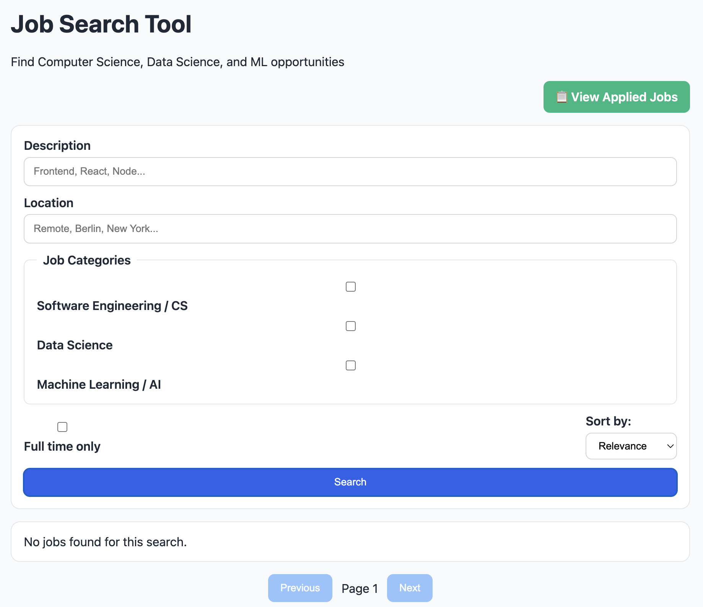

# Job Search Tool 🔍

A modern, full-featured job search application that aggregates Computer Science, Data Science, and Machine Learning job opportunities from multiple sources including Remotive, Arbeitnow, and The Muse.



## ✨ Features

### 🌐 Multi-Source Job Aggregation
- Fetches jobs from **Remotive**, **Arbeitnow**, and **The Muse**
- Automatic deduplication across sources
- Smart parallel fetching for faster results
- Automatic fallback handling

### 🎯 Smart Filtering & Search
- Category filters: Software Engineering, Data Science, ML/AI
- Location-based filtering
- Full-time/contract job type filtering
- Keyword search across titles and descriptions
- Advanced sorting: by relevance, date, company, or title

### 📝 Application Tracking
- Mark jobs as applied with one click
- Dedicated applied jobs management page
- View application history with timestamps
- Remove jobs from applied list
- Persistent storage using browser localStorage

### 🧹 Quality Assurance
- Human-readable job descriptions (HTML cleaned, entities decoded)
- Automatic spam and low-quality job filtering
- Validation of job data completeness
- Source attribution for transparency

## 🚀 Quick Start

### Prerequisites
- Node.js 16+ and npm

### Installation

### Build for Production

## 📁 Project Structure

```
Github_Job/
├── src/
│   ├── components/
│   │   ├── AppliedJobs.jsx      # Applied jobs management page
│   │   ├── JobCard.jsx           # Individual job card component
│   │   ├── JobDetail.jsx         # Full job details view
│   │   ├── JobsList.jsx          # Job results grid
│   │   ├── Pagination.jsx        # Page navigation
│   │   └── SearchForm.jsx        # Search and filter form
│   ├── hooks/
│   │   ├── useJobsSearch.js      # Job search state management
│   │   └── useQueryParams.js     # URL query parameters hook
│   ├── services/
│   │   └── githubJobs.js         # Multi-source API integration
│   ├── utils/
│   │   └── appliedJobs.js        # localStorage utilities
│   ├── App.jsx                   # Main app with routing
│   ├── constants.js              # App configuration
│   ├── main.jsx                  # React entry point
│   └── styles.css                # Global styles
├── docs/
│   └── images/                   # Documentation screenshots
├── index.html
├── package.json
└── README.md
```

## 🛠️ Technology Stack

- **Frontend Framework:** React 18.3.1
- **Build Tool:** Vite 5.4.10
- **Routing:** React Router DOM 7.13.1
- **Markdown Rendering:** React Markdown 10.1.0
- **Styling:** Vanilla CSS
- **State Management:** React Hooks
- **Data Persistence:** localStorage API

## 🎨 Key Features in Detail

### Multi-Source Job Aggregation
The app fetches jobs from multiple APIs simultaneously:
- **Remotive API** - Remote tech jobs
- **Arbeitnow API** - International opportunities
- **The Muse API** - Curated positions

All sources are queried in parallel using `Promise.all()` for optimal performance.

### Smart Category Classification
Jobs are automatically categorized using keyword detection:
- **Software Engineering:** developer, engineer, frontend, backend, full stack, DevOps
- **Data Science:** data scientist, analyst, engineer, SQL, pandas, analytics
- **Machine Learning:** ML, AI, deep learning, NLP, computer vision, PyTorch

### Human-Readable Descriptions
Advanced text processing ensures quality:
- HTML tags stripped from descriptions
- HTML entities decoded (e.g., `&nbsp;`, `&amp;`)
- Control characters removed
- Spam detection and filtering
- Minimum content length validation

## 📖 Documentation

For detailed usage instructions, see [USERGUIDE.md](USERGUIDE.md).

## 🤝 Contributing

Contributions are welcome! Please feel free to submit a Pull Request.

## 📄 License

This project is open source and available under the MIT License.

## 🔗 Links

- [GitHub Repository](https://github.com/EltonChang1/Github_Job)
- [Portfolio](https://eltonchang1.github.io)

## 👨‍💻 Author

Created by Elton Chang
```
