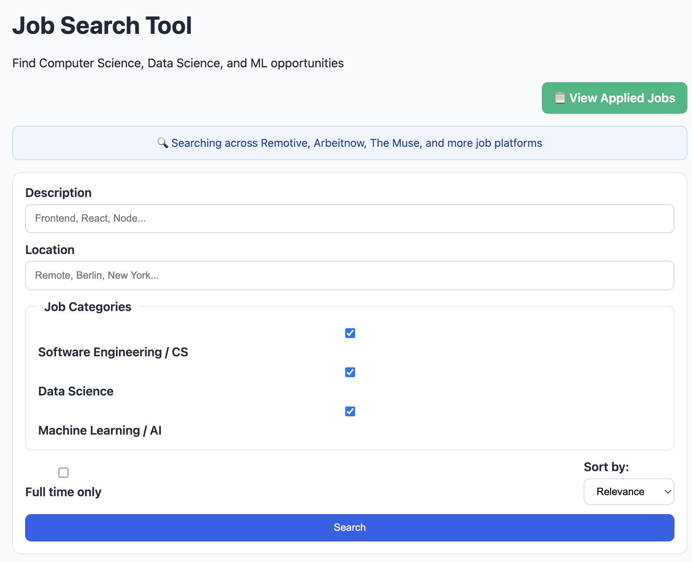
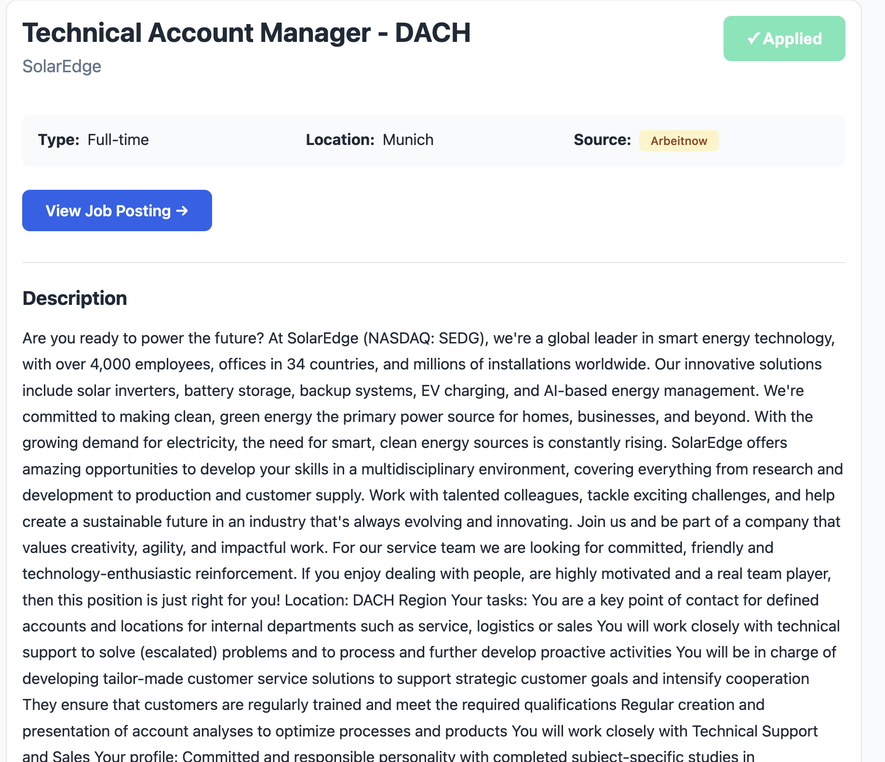
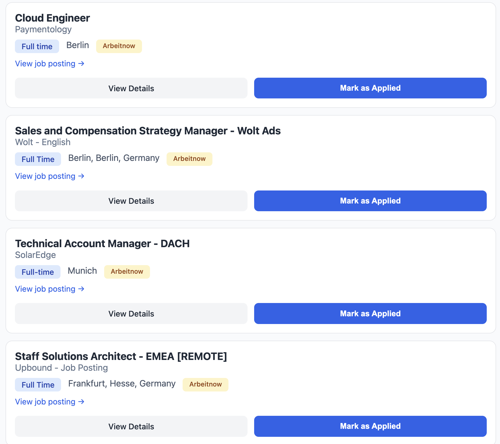
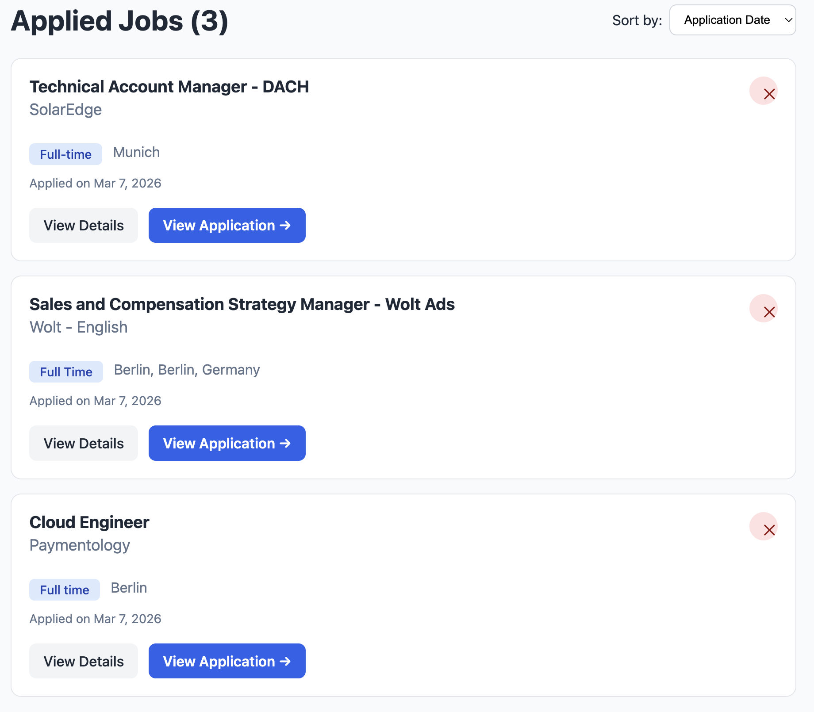

# Job Search Tool - User Guide

Welcome to the Job Search Tool! This guide will walk you through all the features and functionality of the application.

## Table of Contents

1. [Getting Started](#getting-started)
2. [Searching for Jobs](#searching-for-jobs)
3. [Filtering and Sorting](#filtering-and-sorting)
4. [Viewing Job Details](#viewing-job-details)
5. [Managing Applied Jobs](#managing-applied-jobs)
6. [Tips and Best Practices](#tips-and-best-practices)

---

## Getting Started

### Main Search Page

When you first open the application, you'll see the main search interface:

The search page includes:
- **Search Bar** - Enter keywords like "software engineer", "data scientist", or "machine learning"
- **Location Filter** - Find jobs by location or search for "Remote" positions
- **Job Categories** - Filter by Software Engineering, Data Science, or Machine Learning/AI
- **Full-time Toggle** - Limit results to full-time positions only
- **Sort Dropdown** - Order results by relevance, date, company, or job title
- **View Applied Jobs Button** - Quick access to your application history

### Info Banner

At the top of the page, you'll see an information banner indicating that the app searches across multiple platforms:

> 🔍 Searching across Remotive, Arbeitnow, The Muse, and more job platforms

This means you're getting comprehensive results from multiple sources simultaneously!

---

## Searching for Jobs

### Basic Search

1. **Enter Keywords**: Type relevant terms in the Description field:
   - "React developer"
   - "Python machine learning"
   - "Data engineer AWS"
   - "Frontend engineer remote"

2. **Set Location** (optional):
   - Specific cities: "New York", "San Francisco", "London"
   - Remote work: "Remote"
   - Leave blank to search all locations

3. **Click Search**: The app will fetch and display matching jobs

### Job Listings

After searching, you'll see a grid of job cards:

Each job card displays:
- **Job Title** - The position name
- **Company Name** - Who's hiring
- **Job Type Badge** - Full Time, Contract, Part Time, etc.
- **Location** - Where the job is based or if it's remote
- **Salary Badge** (if available) - Compensation range
- **Source Badge** - Which platform the job came from (remotive/arbeitnow/themuse)
- **View Job Posting Link** - Direct link to the original posting
- **View Details Button** - See full job description
- **Mark as Applied Button** - Track your applications

---

## Filtering and Sorting

### Category Filters

Use the category checkboxes to focus your search:

- ✅ **Software Engineering / CS** - General software development roles
- ✅ **Data Science** - Analytics, data engineering, BI roles
- ✅ **Machine Learning / AI** - ML engineers, AI researchers, computer vision

**How it works:**
- Check one or more categories to see only those job types
- Uncheck all to see jobs from all categories
- The app automatically categorizes jobs based on keywords in titles and descriptions

### Sort Options

Choose how to order your results:

- **Relevance** - Best matches for your search terms (default)
- **Date Posted** - Newest jobs first
- **Company** - Alphabetical by company name
- **Job Title** - Alphabetical by position title

### Full-time Only Toggle

Check this box to filter out contract, part-time, and freelance positions, showing only full-time opportunities.

---

## Viewing Job Details

Click "View Details" on any job card to see the complete job description:

The detail page includes:

### Header Section
- **Job Title** - Position name
- **Company Name** - Employer
- **Mark as Applied Button** - Track this application

### Job Metadata
- **Type** - Full Time, Contract, etc.
- **Location** - Office location or Remote
- **Salary** - Compensation range (when available)
- **Source** - Which job board posted this listing

### Action Buttons
- **View Job Posting →** - Opens the original job listing in a new tab

### Description Section
Rich text description including:
- Job responsibilities
- Required qualifications
- Preferred skills
- Company culture information
- Benefits and perks

### How to Apply
Instructions on how to submit your application (when provided by the employer)

### Navigation
- **← Back to results** - Return to your search results

---

## Managing Applied Jobs

### Marking Jobs as Applied

1. **From Job Cards**: Click the "Mark as Applied" button on any job card
2. **From Job Details**: Click "Mark as Applied" in the job detail header
3. **Confirmation**: The button turns green and shows "✓ Applied"

Once marked, the job is saved to your personal application tracker!

### Viewing Applied Jobs

Click the **📋 View Applied Jobs** button at the top of the search page:

The Applied Jobs page shows:

- **Total Count** - Number of jobs you've applied to
- **Sort Controls** - Order by:
  - Date Applied (newest first)
  - Company Name (A-Z)
  - Job Title (A-Z)

### Applied Job Cards

Each card displays:
- Job title and company
- Location
- Salary (if available)
- **Applied on [date]** - Timestamp of when you marked it
- **View Details** - See full job description
- **❌ Remove Button** - Unmark this job

### Managing Your Applications

**To remove a job from your applied list:**
1. Find the job in your Applied Jobs list
2. Click the red **❌** button in the top-right corner
3. The job is immediately removed

**Data Persistence:**
- Your applied jobs are stored in your browser's localStorage
- They persist across sessions (closing and reopening the browser)
- Clearing browser data will reset your applied jobs list

---

## Tips and Best Practices

### Effective Searching

1. **Use Specific Keywords**
   - ❌ "jobs" - Too broad
   - ✅ "senior react developer" - Specific role
   
2. **Combine Keywords**
   - "machine learning python remote" - Multiple relevant terms
   - "data engineer SQL cloud" - Tech stack focused

3. **Try Different Search Terms**
   - "frontend" vs "front-end" vs "front end"
   - "ML Engineer" vs "Machine Learning Engineer"

### Filtering Strategy

1. **Start Broad, Then Narrow**
   - Begin with general keyword search
   - Apply category filters to reduce noise
   - Use full-time toggle if needed
   - Filter by location last

2. **Use Multiple Sources to Your Advantage**
   - Jobs appear with source badges (remotive/arbeitnow/themuse)
   - Each platform has different companies
   - More sources = more opportunities

### Application Tracking

1. **Mark Jobs Immediately**
   - Add to applied list right after submitting
   - Prevents duplicate applications
   - Creates searchable history

2. **Regular Review**
   - Check your Applied Jobs page weekly
   - Follow up on applications after 1-2 weeks
   - Remove jobs you're no longer interested in

3. **Use Job Details**
   - Save the "View Job Posting" link
   - Review "How to Apply" instructions before applying
   - Note any specific application requirements

### Performance Tips

1. **Pagination**
   - Use "Load More" to see additional results
   - App loads 15 jobs per page for faster performance

2. **Bookmarking Searches**
   - URL updates with your filters and search terms
   - Bookmark frequently used searches
   - Share search URLs with friends

3. **Browser Compatibility**
   - Works best in modern browsers (Chrome, Firefox, Safari, Edge)
   - Requires JavaScript enabled
   - localStorage must be enabled for applied jobs feature

---

## Troubleshooting

### No Jobs Found

**If you see no results:**
- Try broader search terms
- Remove location filters
- Uncheck category filters
- Check spelling of keywords

### Jobs Not Loading

**If the app shows loading forever:**
- Check your internet connection
- Refresh the page (Ctrl+R or Cmd+R)
- The app will use sample jobs if APIs are unavailable

### Applied Jobs Not Saving

**If marked jobs disappear:**
- Check if browser is in Private/Incognito mode (doesn't persist data)
- Ensure localStorage is enabled in browser settings
- Try a different browser

### Job Descriptions Look Messy

**If descriptions have weird formatting:**
- Some jobs from external sources may have HTML residue
- The app filters most issues automatically
- Report persistently problematic jobs via GitHub Issues

---

## Keyboard Shortcuts

- **Enter** in search field - Submit search
- **Escape** on detail page - Go back to results
- **Tab** - Navigate through form fields

---

## Privacy & Data

- **No Account Required** - Use the app without signing up
- **Local Storage Only** - Applied jobs stored in your browser only
- **No Tracking** - We don't track your job searches or applications
- **API Calls** - Job data fetched from public APIs (Remotive, Arbeitnow, The Muse)

---

## Need Help?

- **Report bugs**: [GitHub Issues](https://github.com/EltonChang1/Github_Job/issues)
- **Feature requests**: Open a GitHub Issue with "Feature Request" label
- **Questions**: Check the [README](README.md) for technical details

---

**Happy Job Hunting!**
